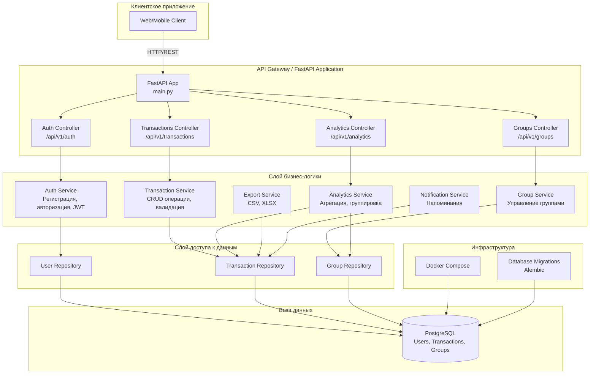

# financial_tracker

## Команда
| Имя               | Роль          | GitHub                                   | Доступность |
|--------------------|---------------|------------------------------------------|------------|
| Анна Милютина     | Аналитика     | [millana4](https://github.com/millana4)  | 9:00 — 21:00|
| Иван Людвиков     | Разработка    | [Vanusha61](https://github.com/Vanusha61)| 9:00 — 22:00|
| Артём Царюк       | Тимлид        | [funcid](https://github.com/funcid)      | 18:00 — 21:00|
| Абида Аюшиев      | Тестировщик   | [ayutoso28](https://github.com/ayutoso28)| 9:00 — 22:00|
| Альбина Шустова   | Разработка    | [AlbinaShu](https://github.com/AlbinaShu)| 12:00 — 23:00| 

## Задание: 6. Приложение для отслеживания расходов
Описание: приложение для управления личными финансами,
позволяющее пользователям фиксировать доходы и расходы и получать
аналитику по ним.

#### Основные функции:

* Добавление финансовых транзакций (доходов и расходов) с
указанием категории.
* Просмотр аналитики с группировкой по категориям и временным
периодам.
* Визуализация данных в виде графиков, например круговая
диаграмма расходов.
* Сортировка транзакций по дате и категории.
Дополнительные функции:
* Экспорт данных в файлы формата `.csv` или `.xlsx`.
* Напоминания о регулярных платежах.
  
#### Требования к бэкенду:

1. Разработать модель данных для реализации основных функций проекта. Минимальный набор таблиц:
* транзакция: идентификатор, наименование, тип (доход или расход), категория, сумма, дата, ссылка на пользователя;
* группа: таблица позволяющая объединить пользователей в группы например для учёта семейных транзакций, идентификатор группы, название группы, ссылка на пользователя.
2. Разработать модель данных для работы сервиса регистрации, авторизации и аутентификации пользователей: идентификатор, имя, фамилия, логин, пароль.
3. Разработать API для регистрации, авторизации и аутентификации. Эндпойнты: регистрация, аутентификация, смена пароля, обновление токена.
4. Разработать API, обеспечивающий работу основных функций для транзакций: создание, удаление, редактирование, чтение (пагинация, фильтры по категории и дате).
5. Разработать API, обеспечивающий работу основных функций для работы с группами:
* создание, удаление, редактирование, чтение;
* аналитика по группам.

#### Результат реализации бэкенда:

1. Разработана модель данных и настроены миграции.
2. Создан API для работы с основными функциями. Код запускается и
выполняет требования задания. Допускается и приветствуется любое
расширение, дополнение и обоснованное улучшение функционала.
3. Разработан набор тестов для проверки всех эндпойнтов API.
4. Развёртывание: создан файл конфигурации Docker Compose для
сборки и запуска проекта в контейнере.

#### Общая архитектура

